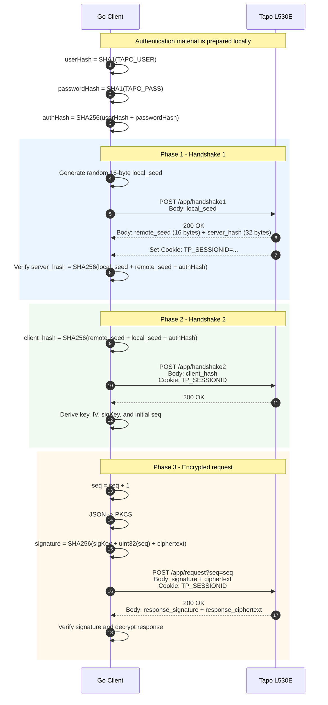
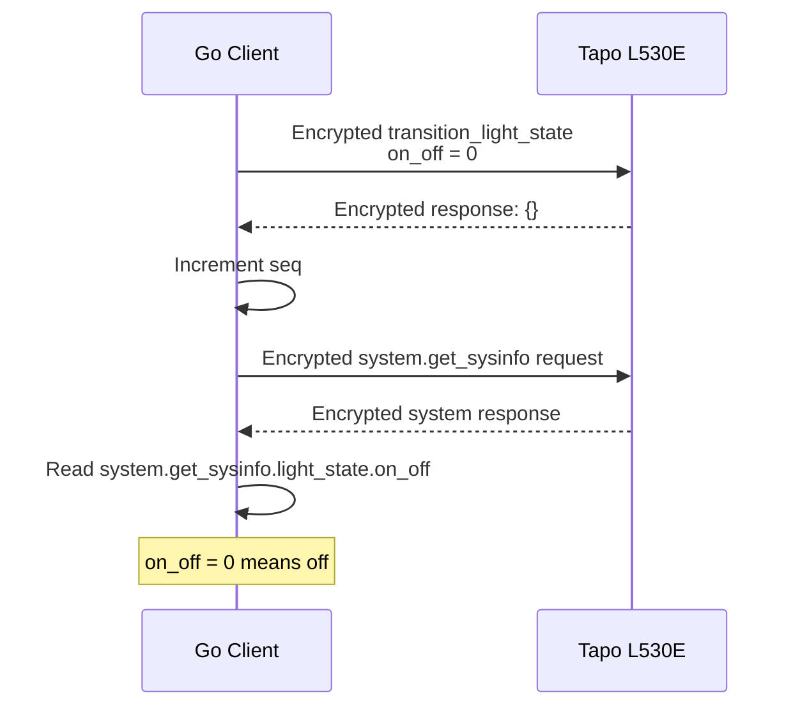

# Tapo L530E KLAP Protocol Sequence

This diagram describes the KLAP v2 local communication flow implemented by this project.
The Tapo L530E is accessed over HTTP on port 80.

## Complete Flow



## Turn-Off Example

The first Phase 3 command sent by `TurnOff` is:

```json
{
  "smartlife.iot.smartbulb.lightingservice": {
    "transition_light_state": {
The current `go/main.go` performs the three phases and calls `TurnOff`:
```bash
cd go
go run .
    }
  }
}
```

The bulb may return an empty JSON object (`{}`) as the command result. The client then sends a second encrypted Phase 3 request to verify the physical state:



The verification request plaintext is:

```json
{
  "system": {
    "get_sysinfo": null
  }
}
```

## Session Key Derivation

After Phase 2, the client derives the values used by Phase 3:

```text
key    = SHA256("lsk" + local_seed + remote_seed + authHash)[0:16]
ivFull = SHA256("iv"  + local_seed + remote_seed + authHash)
sigKey = SHA256("ldk" + local_seed + remote_seed + authHash)[0:28]
iv     = ivFull[0:12]
seq    = signed big-endian integer from ivFull[28:32]
```

For every encrypted request, the AES-CBC IV is:

```text
iv + uint32(seq)
```

The `TP_SESSIONID` cookie must be retained between all three phases and subsequent requests.

## Function Mapping

| Protocol operation | Go function |
|---|---|
| Handshake 1 | `phase1` |
| Handshake 2 | `phase2` |
| Turn off | `TurnOff` |
| Turn on | `TurnOn` |
| Change brightness | `ChangeBrightness` |
| Change color | `ChangeColor` |
| Encrypt/send/decrypt Phase 3 request | `sendKlapRequest` |
| Verify bulb state | `VerifyLightState` |
